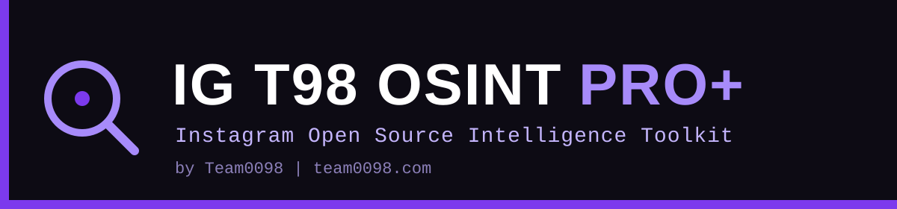
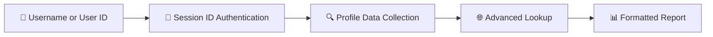

<div align="center">



# 🔍 IG T98 OSINT PRO+

### Instagram Open Source Intelligence (OSINT) Tool

Built for cybersecurity professionals, penetration testers, and ethical hackers who need to gather **publicly available** information from Instagram profiles.


[](README.md)
[](README.fa.md)

[](https://t.me/YOUR_CHANNEL)
[](https://t.me/MvahyR)
[](https://team0098.com)

[Features](#-features) • [Quick Start](#-quick-start) • [Installation](#%EF%B8%8F-installation) • [Usage](#-usage) • [Sample Output](#-sample-output) • [Troubleshooting](#-common-issues--troubleshooting) • [Contact](#-support--contact)

</div>

---

## ⚠️ IMPORTANT LEGAL DISCLAIMER

> [!WARNING]
> **This tool is intended for EDUCATIONAL and AUTHORIZED SECURITY TESTING purposes ONLY.**

| | Policy |
|---|---|
| ✅ **Legal Use** | Authorized penetration testing, security research, educational purposes |
| ❌ **Illegal Use** | Stalking, harassment, unauthorized surveillance, privacy violations |
| 📋 **Your Responsibility** | Users must comply with all applicable laws and regulations |
| 🏛️ **Legal Compliance** | Ensure you have proper authorization before testing any accounts |
| 🔒 **Privacy Respect** | Only gather information that is publicly available |

**The developers of this tool are NOT responsible for any misuse or illegal activities conducted with this software.**

---

## 🌟 Features

| | Feature | Description |
|---|---|---|
| 🔍 | **User Intelligence Gathering** | Extract comprehensive public profile information |
| 📊 | **Engagement Analysis** | Calculate follower-to-following ratios and engagement metrics |
| 🌐 | **Advanced Lookup** | Retrieve obfuscated contact information when available |
| 📱 | **Contact Information** | Extract public email addresses and phone numbers |
| 🖼️ | **Profile Media** | High-resolution profile picture URLs |
| 📈 | **Account Metrics** | Detailed statistics including posts, followers, and following counts |
| 🏢 | **Business Intelligence** | Identify business accounts and verification status |
| 🔗 | **External Links** | Extract website URLs and external connections |
| 🚀 | **Easy Setup** | Automatic dependency installation |
| 💻 | **Cross-Platform** | Works on Windows, macOS, and Linux |

---

## ⚡ Quick Start

```bash
git clone Team0098/IG-T98-OSINT-PRO-
cd IG-T98-OSINT-PRO-
python instarecon.py -u target_username -s your_session_id
```

> [!TIP]
> Don't have a session ID yet? Jump to [Getting Your Instagram Session ID](#-getting-your-instagram-session-id).

---

## 🔄 How It Works



---

## 🛠️ Installation

### Prerequisites

- 🐍 Python 3.6 or higher
- 📸 Valid Instagram account (for session ID)
- 🌍 Internet connection

### Quick Installation

1. **Clone the repository**
   ```bash
   git clone Team0098/IG-T98-OSINT-PRO-
   cd IG-T98-OSINT-PRO-
   ```

2. **Run the tool** (dependencies will auto-install)
   ```bash
   python instarecon.py -u target_username -s your_session_id
   ```

### Manual Installation

If you prefer to install dependencies manually:

```bash
pip install requests phonenumbers pycountry
```

---

## 🚀 Usage

### Basic Usage

**🔎 Search by Username**
```bash
python instarecon.py -u username -s your_session_id
```

**🆔 Search by User ID**
```bash
python instarecon.py -i 123456789 -s your_session_id
```

**🐞 Enable Debug Mode**
```bash
python instarecon.py -u username -s your_session_id --debug
```

### 🔑 Getting Your Instagram Session ID

1. Open Instagram in your web browser and log in
2. Open Developer Tools (`F12` or right-click → Inspect)
3. Navigate to **Application** tab → **Storage** → **Cookies** → `https://www.instagram.com`
4. Find the cookie named `sessionid`
5. Copy the **Value** field


### ⚙️ Command Line Options

| Option | Description | Required |
|---|---|:---:|
| `-h`, `--help` | Show help message and exit | – |
| `-s`, `--sessionid` | Instagram session ID | ✅ |
| `-u`, `--username` | Instagram username to investigate | one of `-u` / `-i` |
| `-i`, `--id` | Instagram user ID to investigate | one of `-u` / `-i` |
| `--debug` | Show debug information and all available fields | – |
| `--no-banner` | Skip the banner display | – |

---

## 📊 Sample Output

```
╔══════════════════════════════════════════════════════════════╗
║                    IG T98 OSINT PRO+                         ║
║                   Instagram OSINT Tool                       ║
║                                                              ║
║        For Penetration Testing & Ethical Hacking             ║
║                      by Team0098                             ║
╚══════════════════════════════════════════════════════════════╝

🔍 Starting reconnaissance for username: target_user
⏳ Gathering intelligence...

============================================================
INSTAGRAM RECONNAISSANCE RESULTS
============================================================

Username               : target_user
User ID                : 1234567890
Full Name              : John Doe
Verified Account       : ✓
Business Account       : ✗
Private Account        : ✗

Engagement Metrics:
Followers              : 15,432
Following              : 892
Posts                  : 156
Following/Follower Ratio: 0.06

External Links:
Website                : https://johndoe.com

Biography:
Photographer | Travel Enthusiast
📧 contact@johndoe.com
🌍 Based in New York

Public Contact Info:
Email                  : john@johndoe.com

Profile Picture        : https://instagram.com/profile_pic_url

────────────────────────────────────────────────────────────
ADVANCED RECONNAISSANCE
────────────────────────────────────────────────────────────
Obfuscated Email       : j***@g****.com
Obfuscated Phone       : +1 ***-***-1234

============================================================

🔒 Security Note: This information is publicly available
   Use responsibly and in accordance with applicable laws.
```

---

## 🔧 Technical Details

### Information Gathered

| Category | Details |
|---|---|
| 👤 **Basic Profile Data** | Username and User ID • Full name and biography • Account verification status • Business account status • Privacy settings |
| 📈 **Engagement Metrics** | Follower count • Following count • Post count • Engagement ratios |
| 📞 **Contact Information** | Public email addresses • Public phone numbers (with country detection) • External website links • Obfuscated recovery information |
| 🖼️ **Media Information** | High-resolution profile pictures • IGTV post counts |

### ⏱️ Rate Limiting

Instagram implements rate limiting to prevent abuse. If you encounter rate limit errors:

- Wait 10-15 minutes between requests
- Use different session IDs if available
- Avoid making too many requests in a short time period

---

## 🐛 Common Issues & Troubleshooting

<details>
<summary><b>❌ "Rate limit reached"</b></summary>

**Solution**: Wait 10-15 minutes and try again. Consider using a different Instagram account.
</details>

<details>
<summary><b>❌ "User not found"</b></summary>

**Solution**: Verify the username spelling. The user might have changed their username or deleted their account.
</details>

<details>
<summary><b>❌ "Request timeout"</b></summary>

**Solution**: Check your internet connection and try again.
</details>

<details>
<summary><b>❌ "Invalid session ID"</b></summary>

**Solution**:
1. Ensure you're logged into Instagram in your browser
2. Get a fresh session ID following the [guide above](#-getting-your-instagram-session-id)
3. Make sure you copied the entire session ID value
</details>

<details>
<summary><b>❌ ModuleNotFoundError</b></summary>

**Solution**: The tool automatically installs dependencies. If this fails:
```bash
pip install requests phonenumbers pycountry
```
</details>

---

## 📚 Educational Use Cases

This tool is designed for legitimate security testing and educational purposes:

| Use Case | Purpose |
|---|---|
| 🛡️ **Penetration Testing** | Assess social media exposure during security audits |
| 🔬 **Security Research** | Study social engineering attack vectors |
| 🧾 **Digital Forensics** | Investigate public social media presence |
| 🎓 **Cybersecurity Training** | Demonstrate OSINT techniques |
| 👁️ **Privacy Awareness** | Show users what information is publicly available |

---

## 🔒 Privacy & Ethics

- 🤲 **Respect Privacy**: Only gather information that is publicly available on Instagram.
- 📝 **Get Authorization**: Always ensure you have proper authorization before investigating accounts.
- ⚖️ **Follow Laws**: Comply with local laws and regulations regarding data collection and privacy.
- 🚫 **Use Responsibly**: Do not use this tool for harassment, stalking, or any malicious activities.
- 📣 **Report Issues**: If you find vulnerabilities in Instagram's platform, report them responsibly to Meta's security team.

## ⚖️ Legal Notice

This tool accesses only publicly available information through Instagram's standard web interface. Users are responsible for ensuring their use complies with:

- Local and international privacy laws
- Instagram's Terms of Service
- Applicable cybersecurity and computer crime laws
- Ethical hacking guidelines and standards

---

## 🤝 Contributing

We welcome contributions! Please follow these guidelines:

1. **Fork** the repository
2. **Create** a feature branch (`git checkout -b feature/amazing-feature`)
3. **Commit** your changes (`git commit -m 'Add amazing feature'`)
4. **Push** to the branch (`git push origin feature/amazing-feature`)
5. **Open** a Pull Request

### Contribution Guidelines

- Follow PEP 8 coding standards
- Add comments for complex functions
- Test your changes thoroughly
- Update documentation as needed
- Respect the ethical guidelines

---

## 📄 License

This project is licensed under the MIT License - see the [LICENSE](LICENSE) file for details.

## 🙏 Acknowledgments

- Instagram for providing public APIs
- The cybersecurity community for OSINT methodology
- Contributors and ethical hackers who improve the tool
- Open source libraries: `requests`, `phonenumbers`, `pycountry`
- Based on the original InstaRecon project by Asad Faizee

---

## 📞 Support & Contact

<div align="center">

| | Channel | Link |
|---|---|---|
| 📢 | **Telegram Channel** (news & updates) | [t.me/YOUR_CHANNEL](https://t.me/YOUR_CHANNEL) |
| 💬 | **Telegram DM** (support & questions) | [@MvahyR](https://t.me/MvahyR) |
| 🌐 | **Website** | [team0098.com](https://team0098.com) |

</div>

- **Issues**: Please use GitHub Issues in this repository
- **Discussions**: Use GitHub Discussions for questions
- **Security**: Report security issues privately via [Telegram DM](https://t.me/MvahyR)

---

<div align="center">

**Remember: With great power comes great responsibility. Use this tool ethically and legally.**

⭐ If you find this tool useful for your security research, please give it a star!

*Maintained by [Team0098](https://team0098.com) for the cybersecurity community*

</div>
