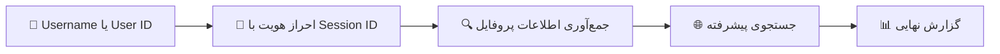

<div align="center">


# 🔍 IG T98 OSINT PRO+

### ابزار اطلاعات‌یابی منبع‌باز (OSINT) اینستاگرام

ساخته‌شده برای متخصصان امنیت سایبری، تست‌نفوذگران و هکرهای اخلاق‌مدار که می‌خواهند اطلاعات **عمومی و در دسترس** پروفایل‌های اینستاگرام را جمع‌آوری کنند.


[](README.md)
[](README.fa.md)

[](https://t.me/YOUR_CHANNEL)
[](https://t.me/MvahyR)
[](https://team0098.com)

[امکانات](#features) • [شروع سریع](#quick-start) • [نصب](#installation) • [نحوه استفاده](#usage) • [نمونه خروجی](#sample-output) • [رفع مشکلات](#troubleshooting) • [ارتباط](#contact)

</div>

---

<div dir="rtl" align="right">

## ⚠️ سلب مسئولیت قانونی (بسیار مهم)

> [!WARNING]
> **این ابزار فقط برای اهداف آموزشی و تست امنیتی مجاز (دارای اجازه‌ی رسمی) ارائه شده است.**

| | سیاست |
|---|---|
| ✅ **استفاده‌ی قانونی** | تست نفوذ مجاز، تحقیقات امنیتی، اهداف آموزشی |
| ❌ **استفاده‌ی غیرقانونی** | تعقیب و آزار، جاسوسی و نظارت غیرمجاز، نقض حریم خصوصی |
| 📋 **مسئولیت شما** | کاربران موظف به رعایت همه‌ی قوانین و مقررات مربوطه هستند |
| 🏛️ **رعایت قانون** | پیش از تست هر حساب، مطمئن شوید اجازه‌ی لازم را دارید |
| 🔒 **احترام به حریم خصوصی** | فقط اطلاعاتی را جمع‌آوری کنید که به‌صورت عمومی در دسترس است |

**توسعه‌دهندگان این ابزار هیچ مسئولیتی در قبال سوءاستفاده یا فعالیت‌های غیرقانونی انجام‌شده با این نرم‌افزار ندارند.**

---

<a id="features"></a>

## 🌟 امکانات

| | امکان | توضیح |
|---|---|---|
| 🔍 | **جمع‌آوری اطلاعات کاربر** | استخراج اطلاعات عمومی و کامل پروفایل |
| 📊 | **تحلیل تعامل (Engagement)** | محاسبه‌ی نسبت فالوور به فالووینگ و معیارهای تعامل |
| 🌐 | **جستجوی پیشرفته** | دریافت اطلاعات تماس مبهم‌شده (Obfuscated) در صورت وجود |
| 📱 | **اطلاعات تماس** | استخراج ایمیل و شماره‌ی تلفن عمومی |
| 🖼️ | **رسانه‌ی پروفایل** | لینک عکس پروفایل با کیفیت بالا |
| 📈 | **آمار حساب** | آمار دقیق شامل تعداد پست، فالوور و فالووینگ |
| 🏢 | **اطلاعات بیزینسی** | تشخیص حساب‌های بیزینسی و وضعیت تأیید (Verified) |
| 🔗 | **لینک‌های خارجی** | استخراج آدرس وب‌سایت و ارتباطات خارجی |
| 🚀 | **نصب آسان** | نصب خودکار وابستگی‌ها |
| 💻 | **چندسکویی** | اجرا روی Windows، macOS و Linux |

---

<a id="quick-start"></a>

## ⚡ شروع سریع

</div>

```bash
git clone <YOUR_REPO_URL>
cd <repo-folder>
python instarecon.py -u target_username -s your_session_id
```

<div dir="rtl" align="right">

> [!TIP]
> هنوز Session ID نگرفته‌اید؟ به بخش [گرفتن Session ID اینستاگرام](#session-id) بروید.

---

## 🔄 نحوه‌ی کار

</div>



<div dir="rtl" align="right">

---

<a id="installation"></a>

## 🛠️ نصب

### پیش‌نیازها

- 🐍 Python نسخه‌ی 3.6 یا بالاتر
- 📸 یک حساب اینستاگرام معتبر (برای گرفتن Session ID)
- 🌍 اتصال به اینترنت

### نصب سریع

۱. **کلون کردن ریپازیتوری**

</div>

```bash
git clone <YOUR_REPO_URL>
cd <repo-folder>
```

<div dir="rtl" align="right">

۲. **اجرای ابزار** (وابستگی‌ها خودکار نصب می‌شوند)

</div>

```bash
python instarecon.py -u target_username -s your_session_id
```

<div dir="rtl" align="right">

### نصب دستی

اگر ترجیح می‌دهید وابستگی‌ها را خودتان نصب کنید:

</div>

```bash
pip install requests phonenumbers pycountry
```

<div dir="rtl" align="right">

---

<a id="usage"></a>

## 🚀 نحوه‌ی استفاده

### استفاده‌ی پایه

**🔎 جستجو با Username**

</div>

```bash
python instarecon.py -u username -s your_session_id
```

<div dir="rtl" align="right">

**🆔 جستجو با User ID**

</div>

```bash
python instarecon.py -i 123456789 -s your_session_id
```

<div dir="rtl" align="right">

**🐞 فعال‌کردن حالت Debug**

</div>

```bash
python instarecon.py -u username -s your_session_id --debug
```

<div dir="rtl" align="right">

<a id="session-id"></a>

### 🔑 گرفتن Session ID اینستاگرام

۱. اینستاگرام را در مرورگر باز کنید و وارد حساب خود شوید
۲. Developer Tools را باز کنید (کلید `F12` یا کلیک راست ← Inspect)
۳. به تب **Application** ← **Storage** ← **Cookies** ← `https://www.instagram.com` بروید
۴. کوکی‌ای با نام `sessionid` را پیدا کنید
۵. مقدار فیلد **Value** را کپی کنید


### ⚙️ گزینه‌های خط فرمان

| گزینه | توضیح | الزامی |
|---|---|:---:|
| `-h`, `--help` | نمایش راهنما و خروج | – |
| `-s`, `--sessionid` | Session ID اینستاگرام | ✅ |
| `-u`, `--username` | Username اینستاگرامِ هدف | یکی از `-u` / `-i` |
| `-i`, `--id` | User ID اینستاگرامِ هدف | یکی از `-u` / `-i` |
| `--debug` | نمایش اطلاعات Debug و همه‌ی فیلدهای موجود | – |
| `--no-banner` | عدم نمایش بنر | – |

---

<a id="sample-output"></a>

## 📊 نمونه‌ی خروجی

</div>

```
╔══════════════════════════════════════════════════════════════╗
║                    IG T98 OSINT PRO+                         ║
║                   Instagram OSINT Tool                       ║
║                                                              ║
║        For Penetration Testing & Ethical Hacking             ║
║                      by Team0098                             ║
╚══════════════════════════════════════════════════════════════╝

🔍 Starting reconnaissance for username: target_user
⏳ Gathering intelligence...

============================================================
INSTAGRAM RECONNAISSANCE RESULTS
============================================================

Username               : target_user
User ID                : 1234567890
Full Name              : John Doe
Verified Account       : ✓
Business Account       : ✗
Private Account        : ✗

Engagement Metrics:
Followers              : 15,432
Following              : 892
Posts                  : 156
Following/Follower Ratio: 0.06

External Links:
Website                : https://johndoe.com

Biography:
Photographer | Travel Enthusiast
📧 contact@johndoe.com
🌍 Based in New York

Public Contact Info:
Email                  : john@johndoe.com

Profile Picture        : https://instagram.com/profile_pic_url

────────────────────────────────────────────────────────────
ADVANCED RECONNAISSANCE
────────────────────────────────────────────────────────────
Obfuscated Email       : j***@g****.com
Obfuscated Phone       : +1 ***-***-1234

============================================================

🔒 Security Note: This information is publicly available
   Use responsibly and in accordance with applicable laws.
```

<div dir="rtl" align="right">

---

## 🔧 جزئیات فنی

### اطلاعات جمع‌آوری‌شده

| دسته | جزئیات |
|---|---|
| 👤 **اطلاعات پایه‌ی پروفایل** | Username و User ID • نام کامل و بیوگرافی • وضعیت تأیید حساب • وضعیت حساب بیزینسی • تنظیمات حریم خصوصی |
| 📈 **معیارهای تعامل** | تعداد فالوور • تعداد فالووینگ • تعداد پست • نسبت‌های تعامل |
| 📞 **اطلاعات تماس** | ایمیل‌های عمومی • شماره‌های تلفن عمومی (همراه با تشخیص کشور) • لینک وب‌سایت‌های خارجی • اطلاعات بازیابیِ مبهم‌شده |
| 🖼️ **اطلاعات رسانه‌ای** | عکس پروفایل با کیفیت بالا • تعداد پست‌های IGTV |

### ⏱️ محدودیت نرخ درخواست (Rate Limiting)

اینستاگرام برای جلوگیری از سوءاستفاده، محدودیت نرخ درخواست اعمال می‌کند. اگر به خطای Rate Limit برخورد کردید:

- بین درخواست‌ها ۱۰ تا ۱۵ دقیقه صبر کنید
- در صورت امکان از Session ID دیگری استفاده کنید
- در بازه‌ی زمانی کوتاه درخواست‌های زیادی نفرستید

---

<a id="troubleshooting"></a>

## 🐛 مشکلات رایج و رفع آن‌ها

<details>
<summary><b>❌ "Rate limit reached"</b></summary>

**راه‌حل**: ۱۰ تا ۱۵ دقیقه صبر کنید و دوباره تلاش کنید. استفاده از یک حساب اینستاگرام دیگر را هم در نظر بگیرید.
</details>

<details>
<summary><b>❌ "User not found"</b></summary>

**راه‌حل**: املای Username را بررسی کنید. ممکن است کاربر Username خود را عوض کرده یا حسابش را حذف کرده باشد.
</details>

<details>
<summary><b>❌ "Request timeout"</b></summary>

**راه‌حل**: اتصال اینترنت خود را بررسی کنید و دوباره امتحان کنید.
</details>

<details>
<summary><b>❌ "Invalid session ID"</b></summary>

**راه‌حل**:
۱. مطمئن شوید در مرورگر وارد اینستاگرام شده‌اید
۲. با راهنمای [بالا](#session-id) یک Session ID تازه بگیرید
۳. مطمئن شوید کل مقدار Session ID را کپی کرده‌اید
</details>

<details>
<summary><b>❌ ModuleNotFoundError</b></summary>

**راه‌حل**: ابزار وابستگی‌ها را خودکار نصب می‌کند. اگر نصب خودکار شکست خورد:

</div>

```bash
pip install requests phonenumbers pycountry
```

<div dir="rtl" align="right">

</details>

---

## 📚 موارد استفاده‌ی آموزشی

این ابزار برای تست امنیتی قانونی و اهداف آموزشی طراحی شده است:

| مورد استفاده | هدف |
|---|---|
| 🛡️ **تست نفوذ** | ارزیابی میزان افشای اطلاعات در شبکه‌های اجتماعی هنگام ممیزی امنیتی |
| 🔬 **تحقیقات امنیتی** | مطالعه‌ی بردارهای حمله‌ی مهندسی اجتماعی |
| 🧾 **فارنزیک دیجیتال** | بررسی حضور عمومی در شبکه‌های اجتماعی |
| 🎓 **آموزش امنیت سایبری** | نمایش تکنیک‌های OSINT |
| 👁️ **آگاهی از حریم خصوصی** | نشان‌دادن اطلاعاتی که به‌صورت عمومی در دسترس است |

---

## 🔒 حریم خصوصی و اخلاق

- 🤲 **احترام به حریم خصوصی**: فقط اطلاعاتی را جمع‌آوری کنید که در اینستاگرام به‌صورت عمومی در دسترس است.
- 📝 **دریافت مجوز**: همیشه پیش از بررسی حساب‌ها مطمئن شوید اجازه‌ی لازم را دارید.
- ⚖️ **رعایت قانون**: قوانین و مقررات محلی درباره‌ی جمع‌آوری داده و حریم خصوصی را رعایت کنید.
- 🚫 **استفاده‌ی مسئولانه**: از این ابزار برای آزار، تعقیب یا هر فعالیت مخرب استفاده نکنید.
- 📣 **گزارش مشکلات**: اگر آسیب‌پذیری‌ای در پلتفرم اینستاگرام پیدا کردید، آن را به‌صورت مسئولانه به تیم امنیت Meta گزارش دهید.

## ⚖️ اطلاعیه‌ی قانونی

این ابزار فقط به اطلاعات عمومی از طریق رابط وب استاندارد اینستاگرام دسترسی دارد. کاربران مسئول‌اند که استفاده‌ی آن‌ها با موارد زیر سازگار باشد:

- قوانین محلی و بین‌المللی حریم خصوصی
- شرایط استفاده از خدمات (Terms of Service) اینستاگرام
- قوانین مربوط به امنیت سایبری و جرائم رایانه‌ای
- اصول و استانداردهای هک اخلاقی

---

## 🤝 مشارکت در پروژه

از مشارکت شما استقبال می‌کنیم! لطفاً این مراحل را دنبال کنید:

۱. ریپازیتوری را **Fork** کنید
۲. یک Branch جدید برای قابلیت خود **بسازید** (`git checkout -b feature/amazing-feature`)
۳. تغییرات خود را **Commit** کنید (`git commit -m 'Add amazing feature'`)
۴. به Branch خود **Push** کنید (`git push origin feature/amazing-feature`)
۵. یک Pull Request **باز کنید**

### راهنمای مشارکت

- استانداردهای کدنویسی PEP 8 را رعایت کنید
- برای توابع پیچیده کامنت بگذارید
- تغییرات خود را به‌خوبی تست کنید
- در صورت نیاز مستندات را به‌روز کنید
- به اصول اخلاقی پایبند باشید

---

## 📄 لایسنس

این پروژه تحت لایسنس MIT منتشر شده است؛ جزئیات را در فایل [LICENSE](LICENSE) ببینید.

## 🙏 قدردانی

- اینستاگرام، به‌خاطر ارائه‌ی APIهای عمومی
- جامعه‌ی امنیت سایبری، برای روش‌شناسی OSINT
- مشارکت‌کنندگان و هکرهای اخلاق‌مدار که ابزار را بهتر می‌کنند
- کتابخانه‌های متن‌باز: `requests`، `phonenumbers`، `pycountry`
- بر پایه‌ی پروژه‌ی اصلی InstaRecon از Asad Faizee

---

<a id="contact"></a>

## 📞 پشتیبانی و ارتباط

</div>

<div align="center">

| | راه ارتباطی | لینک |
|---|---|---|
| 📢 | **کانال تلگرام** (اخبار و به‌روزرسانی‌ها) | [t.me/YOUR_CHANNEL](https://t.me/YOUR_CHANNEL) |
| 💬 | **پیوی تلگرام** (پشتیبانی و سؤالات) | [@MvahyR](https://t.me/MvahyR) |
| 🌐 | **وب‌سایت** | [team0098.com](https://team0098.com) |

</div>

<div dir="rtl" align="right">

- **Issues**: لطفاً از بخش GitHub Issues همین ریپازیتوری استفاده کنید
- **Discussions**: برای پرسش‌ها از GitHub Discussions استفاده کنید
- **امنیت**: مشکلات امنیتی را به‌صورت خصوصی از طریق [پیوی تلگرام](https://t.me/MvahyR) گزارش دهید

</div>

---

<div align="center">

**یادتان باشد: قدرت بیشتر، مسئولیت بیشتر. از این ابزار اخلاقی و قانونی استفاده کنید.**

⭐ اگر این ابزار برای تحقیقات امنیتی‌تان مفید بود، یک ستاره بدهید!

*نگهداری‌شده توسط [Team0098](https://team0098.com) برای جامعه‌ی امنیت سایبری*

</div>
